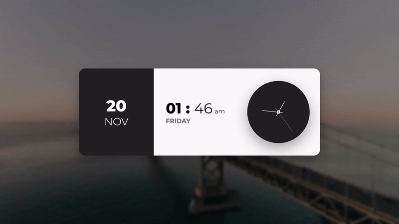

# Javascript Clock

This is a quick javascript project to demonstrate a analog clock using HTML Elements and CSS

## Showcase



## Working

This project makes use of [Unsplash](https://unsplash.com) API to fetch random images and assign it to the background.

The date and time is locally fetched from the users PC to display to the screen.

```javascript
let dateString = new Date()
```

The analog clock hands are moving by changing the CSS transform property of span elements.

```javascript
secDisplay.style.transform = formatTransform((360 / 60) * sec - 90)
minDisplay.style.transform = formatTransform((360 / 60) * min - 90)
hourDisplay.style.transform = formatTransform((360 / 12) * hour - 90)
```
Here the formatTransform function is defined as:

```javascript
function formatTransform(num) {
    return `rotateZ(${num}deg) translateX(-25px)`
}
```
